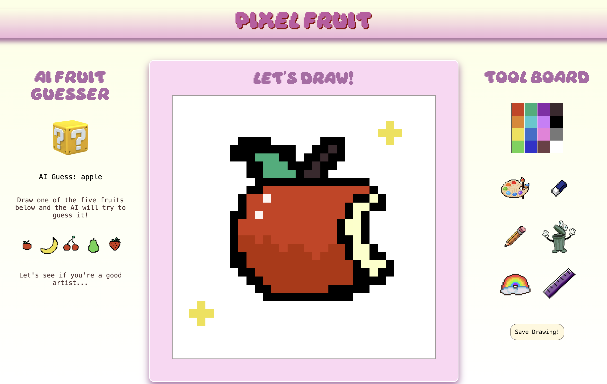

# 🍎 Pixel Fruit - Drawing-Based Fruit Recognition App 2025

An interactive pixel drawing web application that recognizes hand-drawn fruit sketches using a machine learning model served through a FastAPI backend that uses a database of 500+ pixel drawn images of fruits by me! Built the dynamic frontend canvas using HTML, CSS, and JavaScript with drawing, color selection, and erasing tools. Integrated frontend and backend via REST APIs and Python.


---

## 📑 Table of Contents
- [Project Overview](#project-overview)
- [Motivation](#motivation)
- [Features](#features)
- [Screenshots] (#screenshots)
- [Getting Started](#getting-started)
  - [Installation Prerequisites](#installation-prerequisites)
  - [How to Run the Project Locally](#how-to-run-the-project-locally)
  - [Quick Demo](#quick-demo)
- [Architecture Overview](#architecture-overview)
- [Future Development](#future-development)
- [Acknowledgements & Resources](#acknowledgements--resources)

---

## 📌 Project Overview
The **AI Fruit Drawing Recognizer** is a full-stack web application that allows users to draw pixel-based fruit images on a custom canvas and receive real-time predictions from a trained machine learning model.

---

## 💡 Motivation
I’ve always been fascinated by Google’s Quick, Draw! game, and as someone who loves experimenting with digital art, the idea of building my own personalized pixel-based drawing web app was super exciting. I wanted to explore how to design and train an AI model capable of accurately predicting pixelated fruit drawings, while recreating the playful and intuitive experience that Quick, Draw! gave me as a kid, minus the time pressure.

This project was created as an end-to-end exploration of AI application development, combining machine learning with an interactive frontend drawing interface and a backend REST API for real-time model inference.

---

## ✨ Features
- Pixel-based drawing canvas
- Various Tools & Modes: Drawing, Color Picker, Erasing, Rainbow pixels, Clearing the Grid, Saving canvas drawing as PNG file
- Grid-based input optimized for ML predictions
- Fruit classification using a **Keras** model
- **FastAPI** backend serving predictions
- Clean and interactive UI

---

### 📸 Screenshots



## 🚀 Getting Started Guide

### 🔧 Installation Prerequisites
Ensure you have the following installed:

- Python 3.10.0 (make sure you are using this version of python in your terminal)
- pip
- Git

Required Python libraries:
- fastapi
- uvicorn`\[`standard`\]`
- python-multipart
- transformers
- torch
- Pillow
 

---

### ▶️ How to Run the Project Locally

1. Clone the repository:
```
bash
git clone https://github.com/your-username/pixel_fruit.git
cd pixel_fruit
cd backend/

```

2. Install dependencies:

```
pip install -r requirements.txt

```

3. Create and activate a virtual environment:

```
python3.10 -m venv env
source env/bin/activate   # macOS/Linux
env\Scripts\activate     # Windows

```

4. Start the FastAPI backend:

```
uvicorn main:app --reload

```

5. Open the frontend

- Open index.html in your browser (make sure to get out of the backend directory and into the web directory)

  ``` 
  cd ..

  cd web/

  open ./index.html

  ```


- Or serve it using a local server

### 🎮 Quick Demo
1. Draw a fruit from the list given on the canvas

2. Click the Mystery Box button (on hover it will say 'Guess Drawing!')

3. The canvas data is converted into a grid representation

4. The data is sent to the FastAPI API

5. The model returns a predicted fruit class

6. The AI guess prediction is displayed on the UI!

7. You can also use the canvas to free draw whatever you want and click the save button to save your image.

### 🧠 Architecture Overview

# Frontend

- HTML, CSS, JavaScript

- Canvas-based pixel grid

- Converts drawings into numerical input

# Backend

- Python

- FastAPI REST API

- Keras-trained fruit classification model

- Handles preprocessing and inference

# Dataflow : User Drawing → Canvas → API → ML Model → Prediction → UI

### 🔮 Future Development

- Add more fruit classes

- Improve model accuracy

- Cleaner and more active commit history 

- Display prediction confidence

- Support multiple grid sizes

- Introduce game modes or scoring (Quick Draw! style timers)

### 🙌 Acknowledgements & Resources

- Keras Documentation

- FastAPI Documentation

- Drawing recognition inspirations (e.g., Quick, Draw!)

- Online ML learning resources

